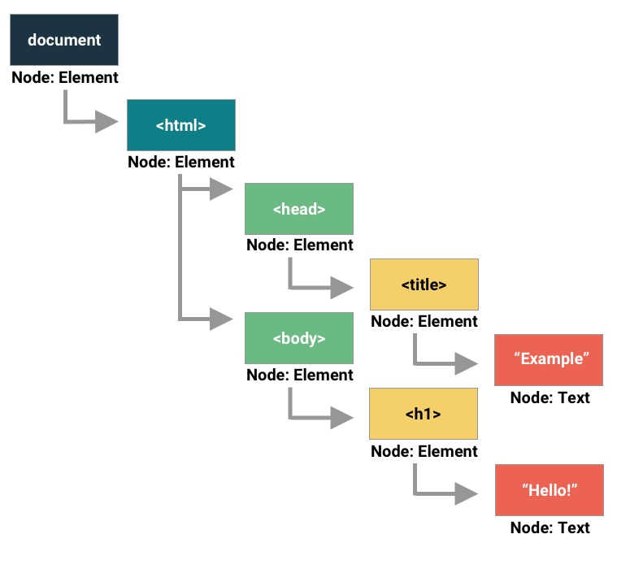

# Objective 1

explain what the DOM is, and how it relates to an html page

## Contents

- [Objective 1](#objective-1)
  - [Contents](#contents)
  - [Overview](#overview)
  - [Follow Along](#follow-along)
    - [DOM Investigation](#dom-investigation)
  - [Challenge](#challenge)
    - [MarkDownNotes](#markdownnotes)

## Overview

When a web page is loaded into a browser, the browser first looks for the HTML file. The browser uses the HTML file as a blueprint, or instructions on how to build the page (this coupled with the CSS file later). The browser parses these instructions and builds a model for how the page should look and act using Javascript. This model is a Javascript Object containing every element in order on the page. This Object is referred to as the DOM, or Document Object Model.

The DOM is built as a data structure known as a 'Tree', because parent elements have nested children elements (or leaves). As with physical trees, we can follow branches of the tree to get to the exact leaf (or leaves) that we want to access. Each branch of our DOM tree can be it's own tree. It is important to remember this as we move through this lesson.

When the DOM is built and the webpage is loaded, developers get access to it in the form of the global Javascript object document. document contains the entire hierarchy of the page, each element (or DOM node), and it also contains dozens of built in methods and properties. We can use these methods and properties to manipulate what we see on the screen.

Note: There are so many methods and properties on document (and its subsequent elements and collections) that it would take a lot longer to properly cover them all. We will only be covering the few most commonly used. From this point forward you will be expected to reference the official documentation to learn more about the different methods and properties available, when your need arises for something other than what we have taught. This is a very good habit to get into as we progress deeper in to the course.

## Follow Along

### DOM Investigation

Lets investigate the DOM together by visiting a live website and updating the DOM. Follow these steps in order:

**Prerequisite: This tutorial assumes you are using Google Chrome. You can get similar results in any other browser but these steps were tailored for a chrome experience.**

1. Navigate to [lambdaschool.com](https://lambdaschool.com/) (Links to an external site.).
2. Right click on the main heading and you should see a dropdown with an option to {inspect element}. Click that option and chrome developer tools should activate.
3. The developer tools should be showing the selection you made when you right clicked. Double click the content of the heading. You should now be able to edit the text of the header.
4. Update the text with anything you'd like. For this example, I will update the text to say "Hello there!" You won't see any changes until you deselect the content in the chrome developer tools.
5. Now try updating the content and HTML of other elements on the page.

Notice that if you refresh the page, the changes you made are gone! **That is because the elements you were editing existed in the DOM and were not permanent!**

You now have experience editing the DOM without writing code. Go check out the challenge below to see the DOM inside the console!

## Challenge

Open the console in your web browser and enter `console.log(document);.`

This should make the document appear on the screen, play around with it for a minute. Notice how the document contains all of the HTML elements (otherwise now known as DOM nodes) on the page. Hover over these nodes and notice how the element on the page is highlighted.

### MarkDownNotes

[Mark Down Notes You Tube](https://www.youtube.com/watch?v=pTCROLZLhDM&t=635s)

[VS Code Cheat Sheet](http://bit.ly/vscodecs)
