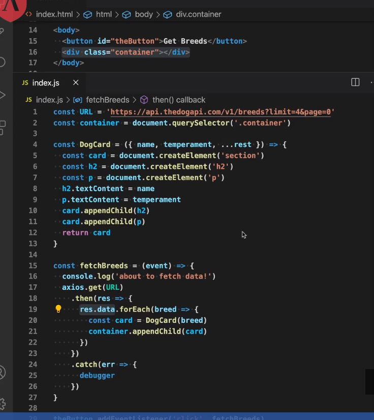

# Objective 2 

- understand HTTP requests and get data from a server using axios

## Contents 

- [Objective 2](#objective-2)
  - [Contents](#contents)
  - [Overview](#overview)
    - [HTTP](#http)
    - [axios](#axios)

## Overview



### HTTP

HTTP is a network protocol, a set of rules that govern the way web clients, like a browser, communicate with web servers over the internet.

We, as developers, need to know what `HTTP Methods` are and how they are used to perform **CRUD (Create, Read, Update, Delete)** operations on server resources and what HTTP status codes are and what they are used for.

`HTTP Methods` provide a common language or nomenclature that the client can use to let the server know what operation it wants to perform.

When a client needs to ask a server for information it should do a GET request specifying a URL that points to the desired resource.

A POST request is used to ask the server to add or create new resources.

The method used by the client to ask the server to make changes to specific resources is PUT.

To remove or delete data from the server the client needs to send a DELETE request.

We will see examples of how to use those methods from our React Applications.

`HTTP Status Codes` are used to indicate if a request has been successful or not and why. The server will set the status code for all responses sent to the client.

### axios

`axios` is a Javascript library. It is used to send HTTP requests to servers. It is not necessary to do this, but it makes things much easier. Because all server requests are asynchronous, `axios` uses Promises. Once you get the basic pattern down, axios is incredibly easy to use.

To read more you can check out the documentation here: [axios/aciosn](https://github.com/axios/axiosn) (Links to an external site.)

In this lesson we are only going to concern ourselves with the HTTP GET request, this will allow us to ask a server for data.

We need to start by including some code in our HTML file, this will essentially download axios and allow us to use it in our own javascript file.

We will put the following line in the `head` section of our HTML:

```JavaScript
<script src="https://unpkg.com/axios/dist/axios.min.js"></script>
```

Now that we have access to the axios library in our Javascript file we can start to use it. For now we will just use it to request data from a server when we load the page, although we could request that data based on user interaction, or anything really.

`axios` is an object containing many methods, `.get` being one of them. It takes a string as its first argument. This string is the url of the resource we are requesting:

```JavaScript
axios.get(url)
```

axios.get will return a Promise to us. This tells us that it is busy getting the data and will return in a moment. As with all promises, we will use `.then` and `.catch` to deal with the data.

```JavaScript
axios.get('http://serverlocation.com/data')
    .then( response => {
        // deal with the response data in here
    })
    .catch( err => {
        // deal with the error in here
    })
```