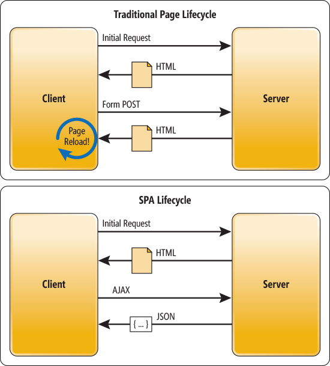

# Objective 1 

- explain the difference between client-side routing and sever-side routing

- [Objective 1](#objective-1)
  - [Overview](#overview)
    - [What is a Server?](#what-is-a-server)
    - [Server-Side Routing](#server-side-routing)
    - [Client-Side Routing](#client-side-routing)
  - [Follow Along](#follow-along)
  - [Challenge](#challenge)

## Overview
What is Routing?
Being able to access information based on a URL is not only a powerful tool at our disposal as end-users and developers, but it is also a standard. Routing is essential for handling a communication piece between computers. Routing is the way we navigate through websites and web applications today. When we click on a link on any web app or website, we are routing to a URL and requesting some information that lives somewhere else. You do this every day - just type www.google.com in a web browser, and you've utilized routing to get resources from a server.

### What is a Server?
Before we talk about the how of routing, we need a solid definition of the what. In computer science, the term "server" refers to centralized resources on a network. These servers are physical devices, usually housed with other servers in large warehouses, that run the "behind the scenes" work of the internet like data storage. When you route, you're routing to a server.

You may be familiar with this type of server room from movies or TV. Each one of those boxes is a server, housing thousands of filing cabinets worth of data every couple of inches.

Websites and Web-applications all rely heavily on information that is controlled by a server. We can't get away from them, even when we hear buzz-words like "serverless" servers (hint: they're not really server-less) we still rely on machines that communicate across channels to deliver content to us as end-users. Imagine if every time you clicked on something on a website, you had to request a resource from a server, and then the server had to go and retrieve that resource, and then that server had to send back some HTML/CSS and eventually some JavaScript in order to display the data on the screen. For a long time, this was how the web worked.This hasn't entirely gone away, but we now have a slightly better way of doing things.

This image does a really good job of showing some of the key differences between Client-side (traditional) and Server-side(SPA) routing.

### Server-Side Routing
When we request information from a server (by clicking on a link or button), that server then sends back the document that was requested. For example, we click on a link and our URL changes to match the request, then the server goes and finds a template or some HTML file and sends it back across the world wide web to deliver that content to the user.

All of this is handled and achieved on the server, and there are a few things that happen here. First, the server will refresh the web page that we're looking at. This is because a new request was made for information, and the information given was a bunch of DOM elements, so we have to re-paint the web page. The information requested will be the only information given, no more, and no less. Because of this, we get the opportunity to load smaller portions of the webpage as opposed to requesting/loading the entire thing the whole time the way that we do in Client-Side Routing.

When you (the client) request a lot of information, your computer and subsequent internet-related devices run through a lot of protocols. The process can be really slow, especially when bandwidth is an issue.

### Client-Side Routing
Now that we know about how things used to be done, we can talk about modern routing. Javascript and the other tools that we get to work with within Javascript are super sophisticated. Because of the arrival of tools like Google Chrome's V8 Engine (Links to an external site.), we can do a lot of things that weren't previously possible. One of those new patterns is using JavaScript to maintain state (or memory) within our applications and use that memory to tell the Browser what to display when a resource is requested.

When Routing is handled internally by the JavaScript that is already on the page, we achieve what is known as Client-side routing. And this tool is how we get things done today, especially in React! And the best part about this is that the page won't refresh! The data is just there, displayed when we ask for it. How this works is that when a user clicks on a requested resource, instead of the client asking for that resource from the server via a URL, JavaScript will prevent this. We then get the resource (state) that is already available to us rendered out, and when using react, this happens beautifully through component-based architecture.

## Follow Along
Read through this medium article [here](https://medium.com/@wilbo/server-side-vs-client-side-routing-71d710e9227f) (Links to an external site.). Look at the image above as you read for a visual representation of how both server-side routing and client-side routing work.

## Challenge
On your own, write down some of the pros and cons for both server-side routing and client-side routing, and then write a paragraph of what you like about both, and which you would prefer to use and why. Submit this to your TL via slack.